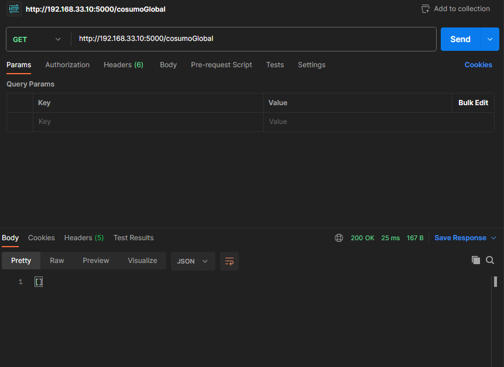
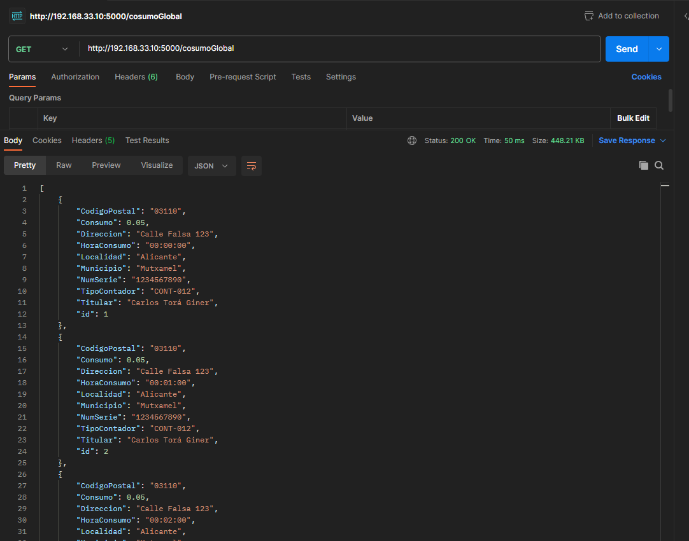
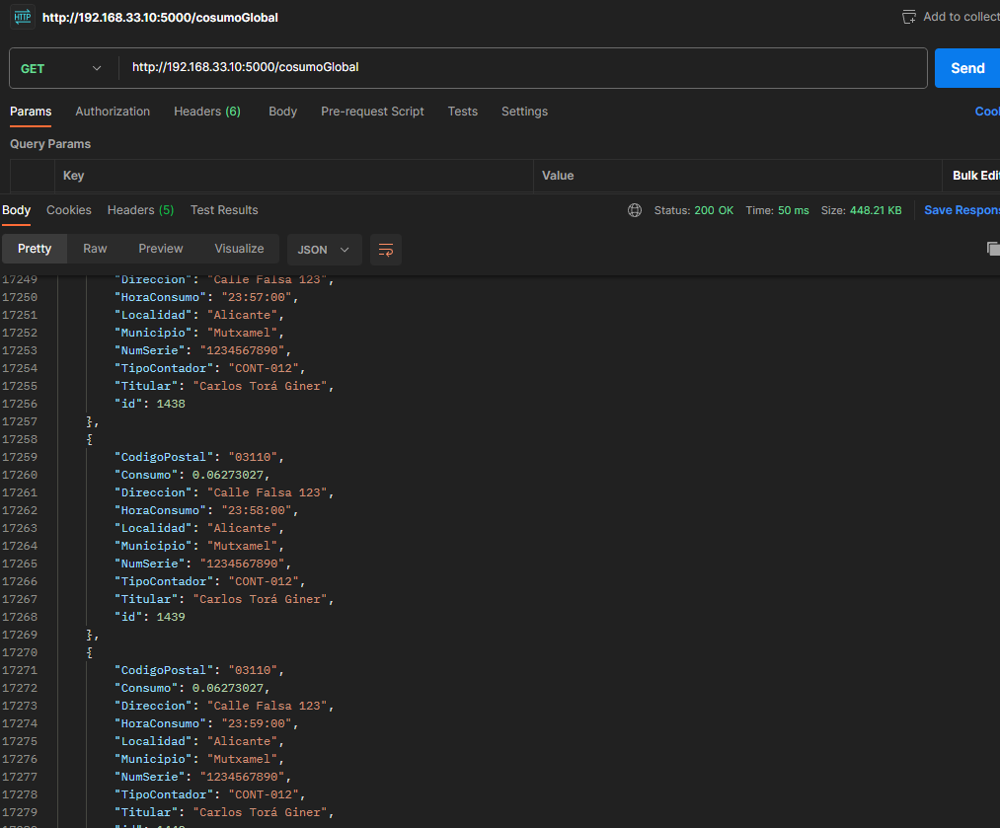

# Simulador de un contador de agua

### Descripción del proyecto

Este proyecto tiene como objetivo simular y registrar el consumo de agua en diferentes momentos del día. Se compone de una infraestructura virtualizada mediante Vagrant, que configura dos máquinas virtuales: una que actúa como servidor (`servidor`) y otra que representa un contador de agua (`contador`).

El `servidor` está basado en Flask y gestiona una API REST para recibir y almacenar datos en una base de datos PostgreSQL. Por otro lado, el `contador` simula el consumo de agua con valores variables a lo largo del día y envía estos datos al servidor periódicamente.

Esta documentación detalla la configuración de estas máquinas, el código utilizado y su interacción dentro del sistema.

## 1. Vagrantfile

El `Vagrantfile` es el archivo de configuración utilizado para definir y aprovisionar máquinas virtuales con Vagrant. En este caso, define una infraestructura con dos máquinas: `servidor` y `contador`.

### Configuración de la máquina "servidor":

```ruby
config.vm.define "servidor" do |servidor|
  servidor.vm.box = "ubuntu/focal64"
  servidor.vm.network "private_network", ip: "192.168.33.10"
  servidor.vm.provision "shell", inline: <<-SHELL
    apt-get update
    apt-get install -y postgresql postgresql-contrib libpq-dev python3 python3-pip
    pip3 install flask psycopg2-binary

    # Configuración de PostgreSQL
    sudo -u postgres psql -c "CREATE DATABASE agua;"
    sudo -u postgres psql -c "ALTER USER postgres PASSWORD 'vagrant';"

    # Permitir conexiones externas
    echo "listen_addresses = '*'" | sudo tee -a /etc/postgresql/10/main/postgresql.conf
    echo "host all all 0.0.0.0/0 md5" | sudo tee -a /etc/postgresql/10/main/pg_hba.conf
  
    # Reiniciamos PostgreSQL
    systemctl restart postgresql
  SHELL
end
```

#### Explicación:

- Se define la máquina `servidor`.
- Se usa la caja `ubuntu/focal64` como base.
- Se asigna una IP privada `192.168.33.10`.
- Se instala Python, PostgreSQL y los paquetes necesarios para correr Flask.
- Se configura PostgresSQL y se habilitan las conexiones externas
- Reiniciamos PostgreSQL

### Configuración de la máquina "contador":

```ruby
config.vm.define "contador" do |contador|
  contador.vm.box = "ubuntu/focal64"
  contador.vm.network "private_network", ip: "192.168.33.11"
  contador.vm.provision "shell", inline: <<-SHELL
    apt-get update
    apt-get install -y python3 python3-pip
    pip3 install requests numpy
  
    # Configurar zona horaria a Europe/Madrid
    sudo timedatectl set-timezone Europe/Madrid

    # Copiar contador.py si aún no existe
    if [ ! -f /home/vagrant/contador.py ]; then
      cp /vagrant/contador.py /home/vagrant/contador.py
    fi

    # Asegurar que el script tiene permisos de ejecución
    chmod +x /home/vagrant/contador.py

    # Configurar CRON para ejecutar el script cada minuto de 09:00 a 09:24
    (crontab -l 2>/dev/null | grep -v 'contador.py'; echo "0-24 9 * * * /usr/bin/python3 /home/vagrant/contador.py >> /home/vagrant/contador.log 2>&1") | crontab -

    # Reiniciar cron para aplicar cambios
    sudo systemctl restart cron
  SHELL
end
```

#### Explicación:

- Se define la máquina `contador`.
- Se usa la caja `ubuntu/focal64` como base.
- Se asigna una IP privada `192.168.33.11`.
- Se instala Python y las librerías necesarias (`requests`, `numpy`).
- Se configura la zona horaria a `Europe/Madrid`.
- Se insetar el fichero `contador.py` , si no existiera, y se asegura de tener los permisos necesarios para ejecutarlo
- Configuramos el CRON para que se ejecute el script a las 9:00 durante 24 min

## 2. servidor.py

Este archivo implementa un servicio REST utilizando Flask. Permite recibir y almacenar datos de consumo de agua en una base de datos PostgreSQL.

### Funcionalidad Clave:

1. **Conexión a PostgreSQL**: Se define una conexión con la base de datos `agua`.
2. **Creación de la tabla**: Si no existe, se crea la tabla `consumo_agua` para almacenar los datos.
3. **Rutas API**:
   - `GET /consumo/<id>`: Obtiene un consumo de agua por el identificador.
   - `GET /cosumoGlobal`: Obtiene todos los consumos registrados.
   - `POST /consumo`: Recibe y almacena un nuevo registro de consumo de agua.

Ejemplo de estructura de la tabla:

```sql
CREATE TABLE IF NOT EXISTS consumo_agua (
    id SERIAL PRIMARY KEY,
    hora_consumo TEXT,
    consumo REAL,
    tipo_contador TEXT,
    num_serie TEXT,
    titular TEXT,
    localidad TEXT,
    municipio TEXT,
    codigo_postal TEXT,
    direccion TEXT  
);
```

### Ejemplo de Registro de Consumo

Un contador de agua envía datos en este formato:

```json
{
    "HoraConsumo": "14:35:00",
    "Consumo": 2.5,
    "TipoContador": "CONT-012",
    "NumSerie": "1234567890",
    "Titular": "Carlos Torá Giner",
    "Localidad": "Alicante",
    "Municipio": "Mutxamel",
    "CodigoPostal": "03110",
    "Direccion": "Calle Falsa 123"
}
```

## 3. contador.py

Este script simula el consumo de agua y lo envía periódicamente al servidor Flask.

### Funcionalidad Clave:

1. **Generación de consumo simulado**:
   - Se utiliza una función Gaussiana para modelar el consumo variable durante el día.
   - Se definen picos de consumo en horarios matutino, mediodía y nocturno.
2. **Simulación de 24 horas**:
   - Se divide el tiempo en 1440 minutos (24 horas * 60 minutos).
   - Se ajusta la simulación para que se ejecute en tiempo real con ciclos de 60 iteraciones por minuto.
3. **Envío de datos al servidor**:
   - Se registra el consumo de cada minuto enviando los datos mediante una petición `POST` a `http://192.168.33.10:5000/consumo`.

Ejemplo de implementación de la función de consumo:

```python
def gaussian(t, A, mu, sigma):
    return A * np.exp(-((t - mu)**2) / (2 * sigma**2))
```

### Flujo de Trabajo:

1. Se genera el consumo para cada minuto del día basado en la ecuación gaussiana.
2. Cada minuto, se envía un nuevo registro al servidor mediante una petición HTTP `POST`.
3. Se imprime la respuesta del servidor en la consola.

Ejemplo de salida en consola:

```shell
Minuto simulado: 720/1440 - Consumo: 2.34 - Respuesta: 201
```

## 4. Interacción entre Componentes

1. `Vagrant` levanta las máquinas `servidor` y `contador`.
2. `servidor.py` inicia un servidor REST en `0.0.0.0:5000`.
3. `contador.py` genera datos simulados y los envía al servidor.
4. `servidor.py` almacena los datos en la base de datos PostgreSQL.

De esta manera, el sistema simula y almacena el consumo de agua para su análisis posterior.

## 5. ¿Como hacerlo funcionar?

Pues gracias a vagrant, nosotros no tendremos que configurar nada, ni acceder a ninguna maquina virtual, ya que con un simple `vagrant up`, se crearán automaticamente ambas maquinas (`contador`y `servidor`) dotandolos de todo lo necesario para que (segun la expresion cron configurada en el fichero vagrant, actualmente esta a las 13:00) se ejecutará el fichero `contador.py` y este mismo, será el responsable de enviar los datos al `servidor` donde se almacenarán en la base de datos postgreSQL

Para verificar los datos, se ha creado un endpoint especifico : `http://192.168.33.10:5000/cosumoGlobal`

- Como podemos observar, antes de la inserción de los datos, dicho endpoint nos devuelve un json vacio:




- Una vez empieza la inserción de datos por el contador, podemos observar como se van insertando los datos (minuto a minuto) enviados por el contador, con la estructura previamente explicado:



- Si asi continuará durante los siguiente 24 minutos (simulando los 24 horas) llegando hacer los 1440 registros correspondientes a todos los minutos del dia:

  
